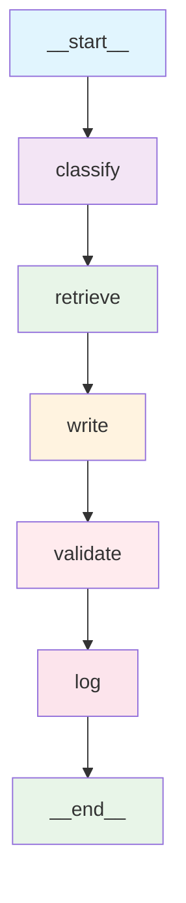

# CONTEXT.md

This document describes the **business, user, and product context** for the Agentic Support Copilot project.

---

# 🌟 Purpose

The goal of the project is to build a realistic, modern **agentic AI system**, reflecting what leading AI engineering teams expect today.  
It demonstrates:

- multi-agent orchestration
- RAG+ retrieval
- guardrails & moderation
- observability (latency, token usage)
- high-quality response generation
- clean UX for interacting with agentic systems

The project is designed as an advanced side project and portfolio piece.

---

# 🎯 Product Concept

The **Agentic Support Copilot** transforms customer support messages into draft replies.

User flow:

1. User pastes a support ticket or customer message.
2. The system:
   - analyzes intent and sentiment
   - retrieves relevant knowledge
   - drafts a grounded reply
   - validates safety and correctness
3. User sees:
   - final AI-generated answer
   - used knowledge snippets
   - full agent trace (step-by-step reasoning path)
   - latency & token metrics

---

# 🔄 Multi-Agent Workflow

The system uses a **sequential multi-agent pipeline** orchestrated by LangGraph:

## Agent Pipeline Details:

1. **Classifier Agent** - Identifies intent, sentiment, and urgency from the request
2. **Retriever Agent** - Searches the knowledge base for relevant information using vector embeddings
3. **Writer Agent** - Generates a grounded response using retrieved knowledge
4. **Guard Agent** - Validates response for safety, hallucinations, and policy compliance
5. **Logger Agent** - Captures metrics, latency, and final evaluation

**Performance:** ~8-15 seconds per request with real Azure OpenAI API calls

---

# 👤 Target User

Primary target user:

- The **developer building the project**, and
- Recruiters / hiring managers evaluating AI engineering capability.

The purpose is to demonstrate applied skills, not to ship a commercial SaaS.

---

# 🧪 Why This Project?

This project is inspired by real job requirements including:

- Agents & chains
- RAG+
- Moderation & guardrails
- Observability & evaluation
- Realtime interactions
- Agent-to-agent workflows
- Knowledge management

It mirrors technologies used by modern AI teams.

---

# 🧵 MVP Scope

Includes:

- End-to-end agent pipeline
- Small KB
- RAG+ retrieval
- Guardrails
- Agent trace
- Metrics

Excludes:

- Multi-user support
- File ingestion
- Complex KB editors
- Mobile app
- Advanced analytics

---

# 🏁 Definition of Success

The MVP is successful if the user can:

- Paste any realistic support request
- Receive a grounded, high-quality answer
- Inspect the source documents
- See the agent workflow
- View latency & token metrics
- Understand the system end-to-end

Providing a polished demonstration of modern AI engineering.
